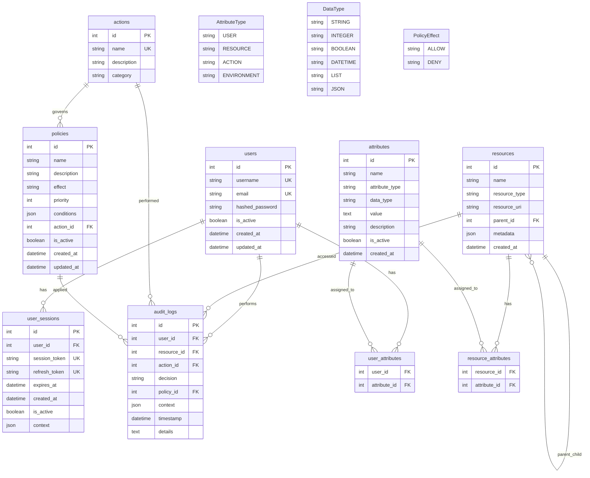

# Entity Relationship Diagram

This ERD shows the database schema for the ABAC (Attribute-Based Access Control) system.

## Key Relationships

### Core ABAC Components
- **Users**: Identity entities with attributes
- **Resources**: Protected objects with hierarchical structure
- **Actions**: Operations that can be performed
- **Attributes**: Flexible key-value pairs for all entities
- **Policies**: Rules that define access control logic

### Many-to-Many Relationships
- Users ↔ Attributes (via user_attributes junction table)
- Resources ↔ Attributes (via resource_attributes junction table)

### One-to-Many Relationships
- Users → UserSessions (authentication tracking)
- Actions → Policies (action-specific policies)
- Resources → Resources (hierarchical resources)

### Audit Trail
- All access decisions are logged in audit_logs with references to:
  - User making the request
  - Resource being accessed
  - Action being performed
  - Policy that was applied
  - Decision context and result

## Attribute System
The flexible attribute system allows for:
- **User attributes**: roles, departments, clearance levels
- **Resource attributes**: classification, owner, sensitivity
- **Action attributes**: operation type, risk level
- **Environment attributes**: time, location, network context

## Policy Engine
Policies contain JSON conditions that are evaluated against the attribute context to make ALLOW/DENY decisions with configurable priority levels.